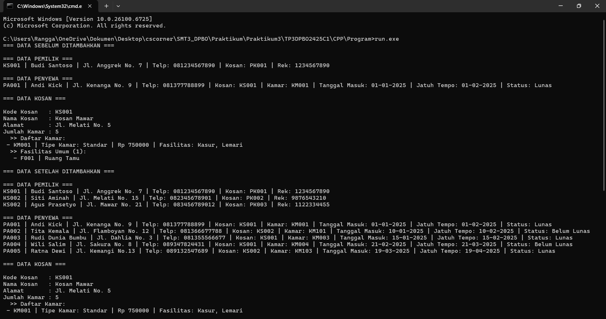
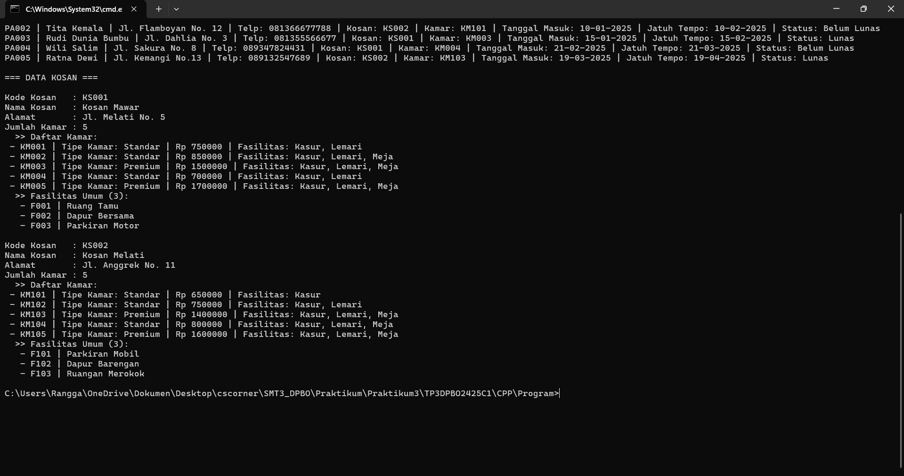
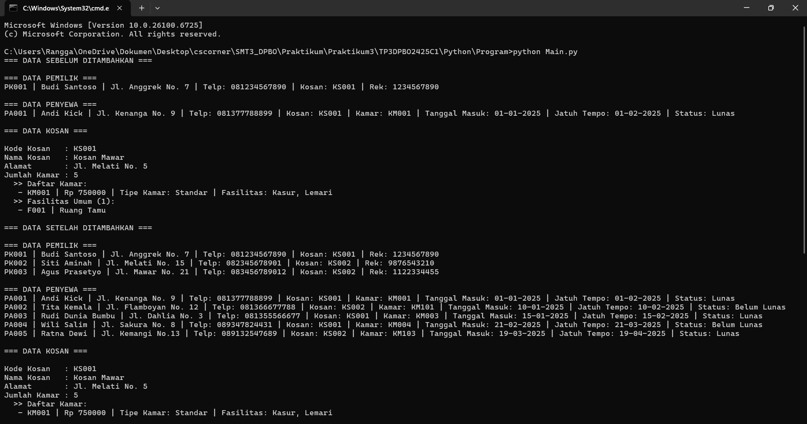
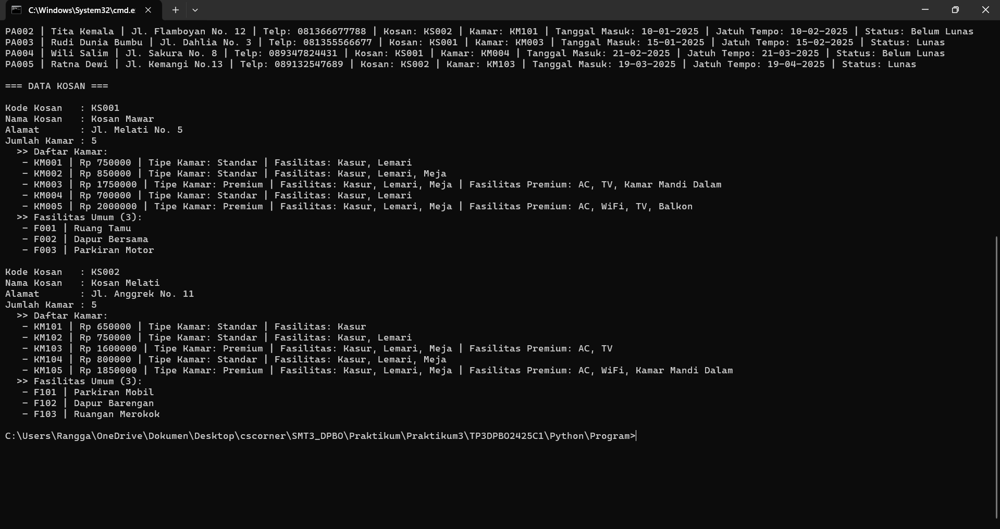
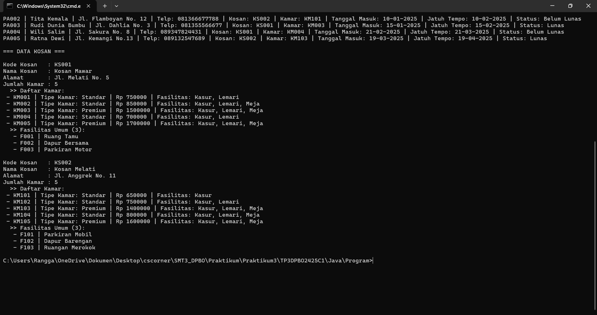

# TP3DPBO2425C1
TP 3 DPBO Kosan

# Janji
Saya Muhammad Rangga Nur Praditha dengan Nim 2400297 mengerjakan Tugas Praktikum 3 dalam mata kuliah Desain Pemrograman Berorientasi Objek untuk keberkahan-Nya maka saya tidak akan melakukan kecurangan seperti yang telah di spesifikasikan

# Diagram

  

# Deskripsi Desain Diagram dan Class

Pada repositori ini berisi program OOP dalam 3 bahasa yaitu C++, Java, dan Python. Program ini menerapkan konsep Inheritance Lanjutan & Composition dengan 7 class dan Main, diantaranya:

## Diagram
Pada diagram ada beberapa hubungan diantara nya Hierarchical Inheritance, Inheritance, Composition, dan Agregation.  
1. Hierarchical Inheritance  
Hierarchical Inheritance dipakai pada tiga class yaitu Orang dengan sebagai induk, Pemilik dan Penyewa sebagai turunan. Dalam class Orang berisi hal umum bagi data orang, sedangkan pada class Pemilik berisi hal
yang mengarah kepada pemilik kosan dengan mengambil juga data umum orang, dan class Penyewa berisi hal yang mengarah kepada penyewa kosan dengan mengambil juga data umum orang  
2. Inheritance  
Inheritance dipakai pada class Kamar dan KamarPremium dengan Kamar sebagai induk, KamarPremium sebagai turunannya, class ini sebagai pembeda untuk kosan kamar standar dan kamar premium yang pastinya berbeda untuk isi fasilitas kamar nya, tetapi tetap mengambil hal umum dari kamar untuk kamar premium  
3. Composition  
Composition dipakai pada dua class yaitu Kosan dan Kamar, karena kedua class tersebut saling terikat jika salah satu nya hilang, dengan di class Kosan atribut listKamar memegang atribut kodeKamar class Kamar  
4. Dependency  
Dependency dipakai antara class Penyewa dengan class Kosan, karena dalam class Penyewa terdapat atribut KodeKosan yang bergantung pada data Kosan , karena objek Penyewa membutuhkan informasi dari objek Kosan, namun tidak memilikinya secara permanen
5. Agregation  
Agregation dipakai pada beberapa class, yaitu:  
1. Class Pemilik dan Kosan karena Pemilik pada atribut kodeKosan mengambil atribut kodeKosan dari Kosan untuk mengetahui pemilik mempunyai kosan yang mana saja  
2. Class Penyewa dan Kamar karena Penyewa pada atribut kodeKamar mengambil atribut kodeKamar dari Kamar untuk mengetahui kosan mempunyai kamar apa aja  
3. Class Kosan dan FasilitasUmum karena Kosan pada atribut ListFasilitas umum mengambil atribut kodeFasilitasUmum dari FasilitasUmum untuk mengetahui kosan tersebut memiliki fasilitas umum apa saja  

## Class
1. Orang  
Kelas dasar yang menyimpan atribut umum dari orang diantaranya:  
- NoKTP (long): Nomor Ktp orang tersebut 
- Nama (string): Nama orang tersebut  
- Alamat (string): Alamat asal orang tersebut  
- NoTelp (string): Nomor Telepon orang tersebut  
Kelas ini menjadi induk (Hierarchical Inheritance) untuk kelas Pemilik dan Penyewa  
Serta Method:  
- Constructor untuk membuat objek Orang  
- Getter untuk mengambil nilai atribut  
- Setter untuk mengubah nilai atribut  
2. Pemilik  
Kelas turunan dari Orang (Hierarchical Inheritance) yang menambahkan atribut khusus pemilik kosan diantaranya:
- KodePemilik (string): Kode milik pemilik yang punya kosan  
- KodeKosan (string): Kode kosan yang dimiliki oleh pemilik  
- NoRekening (string): Nomor rekening yang dimilik pemilik 
Serta Method:  
- Constructor untuk membuat objek Pemilik  
- Getter untuk mengambil nilai atribut  
- Setter untuk mengubah nilai atribut  
4. Penyewa  
Kelas turunan dari Orang (Hierarchical Inheritance) yang menambahkan atribut khusus penyewa kosan diantarnya:
- KodeSewa (string): Kode sewa dari penyewa  
- KodeKosan (string): Kode kosan dari tempat kosan penyewa  
- Kamar (string): Kode kamar dari tempat kamar penyewa  
- TanggalMasuk (string): Tanggal awal masuk penyewa  
- JatuhTempo (string): Tanggal jatuh tempo penyewa  
- StatusPembayaran (string): Lunas atau belumnya pembayaran penyewa  
Serta Method:
- Constructor untuk membuat objek Penyewa  
- Getter untuk mengambil nilai atribut  
- Setter untuk mengubah nilai atribut  
5. Kosan  
Kelas yang merepresentasikan data kosan, menyimpan atribut diantaranya:
- KodeKosan (string): Kode kosan untuk setiap kosan  
- NamaKosan (string): Nama kosan untuk setiap kosan  
- AlamatKosan (string): Alamat kosan untuk setiap kosan  
- JumlahKamar (string): Jumlah kamar pada kosan tersebut  
- ListKamar (string): List kamar yang ada pada kosan tersebut  
- ListFasilitasUmum (string): List fasilitas umum yang ada pada kosan tersebut  
Kelas ini memiliki Composition dengan Kamar dan Agregation dengan FasilitasUmum  
Serta Method:
- Constructor untuk membuat objek Kosan  
- Getter untuk mengambil nilai atribut  
- Setter untuk mengubah nilai atribut  
6. Kamar  
Kelas yang menyimpan data umum kamar diantaranya:
- KodeKamar (string): Kode dari kamar tersebut 
- TipeKamar (string): Tipe dari kamar tersebut 
- LuasKamar (string): Luas dari kamar tersebut  
- HargaKamar (int): Harga dari kamar tersebut  
- StatusKamar (Kosong/Terisi) (string): Status dari kamar tersebut apakah terisi atau tidak  
- DeskripsiKamar (string): Deskripsi dari kamar tersebut  
- FasilitasKamar (string): Fasilitas dari kamar tersebut  
Serta Method:  
- Constructor untuk membuat objek Kamar  
- Getter untuk mengambil nilai atribut  
- Setter untuk mengubah nilai atribut  
7. KamarPremium  
Kelas turunan (Inheritance) dari Kamar yang menambahkan atribut khusus kamar premium diantaranya:
- TambahanHarga (int): Tambahan harga untuk kamar premium 
- FasilitasKamarPremium (String): Fasilitas tambahan untuk kamar premium  
Serta Method:  
- Constructor untuk membuat objek Kamar  
- PremiumGetter untuk mengambil nilai atribut  
- Setter untuk mengubah nilai atribut  
8. FasilitasUmum  
Kelas yang menyimpan data fasilitas umum dari kosan, dengan atribut diantaranya:  
- KodeFasilitasUmum (string): Kode untuk fasilitas umum pada kosan  
- NamaFasilitasUmum (string): Nama fasilitas umum pada kosan tersebut  
Serta Method:  
- Constructor untuk membuat objek FasilitasUmum  
- Getter untuk mengambil nilai atribut  
- Setter untuk mengubah nilai atribut  
9. Main  
Kelas yang digunakan sebagai program utama untuk membuat objek-objek dari semua kelas di atas, kemudian menampilkan data kosan, daftar kamar dan kamar premium, fasilitas umum, serta data pemilik dan penyewa serta menjalankan program  

# Alur Program
Alur program berjalan sebagai berikut:  
1. Untuk data awal dibuat semua objek - objek yang di perlukan seperti data Orang, Pemilik, Penyewa, Kosan, Kamar, KamarPremium, FasilitasPremium sesuai dengan parameter yang ada  
2. Menambahkan data baru dengan array of object sama seperti data awal tetapi berbeda isi data saja  
3. Setelah menambahkan data baru, menampilkan seluruh data pada class sebelum dan sesudah ditambahkan  

# Dokumentasi
Untuk dokumentasi antara CPP, Python, dan Java memiliki hasil yang sama
## CPP

  
  

## Python

  
  

## Java

  
  

